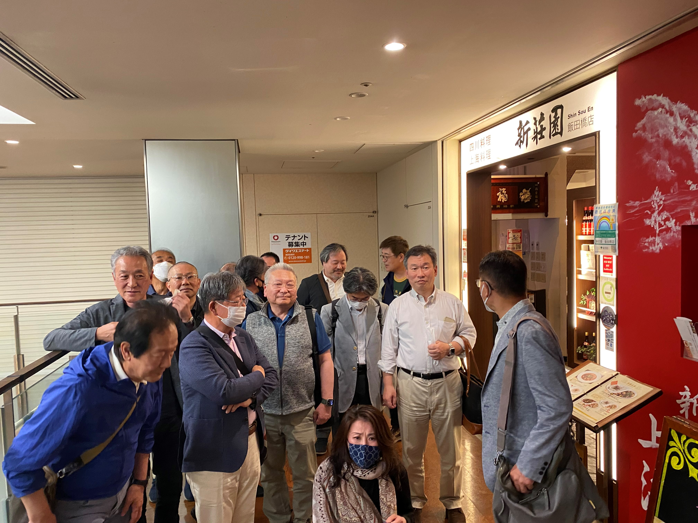

# fts_5

<html lang="ja">
 <head>
  <meta charset="utf-8" />
	 

<link href="https://cdnjs.cloudflare.com/ajax/libs/lightbox2/2.7.1/css/lightbox.css" rel="stylesheet">
 
</head>
<body>

<a href="https://torokoid.github.io/fts_home">Home</a>><a href="https://torokoid.github.io/fts">同窓会</a>><a href="https://torokoid.github.io/fts_2">Teams同窓会</a>><a href="https://torokoid.github.io/fts_3">Teams同窓会_2</a>><a href="https://torokoid.github.io/fts_4">リアル同窓会_2</a>>リアル同窓会_3

<h1><marquee behavior="alternate">!!! 2023年4月21日(金)リアル安否確認会の記録＠個室Dining 新荘園 アイガーデンテラス 飯田橋店 !!!</marquee></h1>

                            
	

    

今回も雅代さんのご尽力により生存確認会、無事開催されました 以下、会のスタート時の混乱の様子です。

  

2023年4月21日(金) 19:11 JUN TOMIZAWA (冨沢 潤) <jun_tomizawa@jp.honda>: 
今永田町です、迷子にならないように頑張ります 
iPhoneから送信  

2023/04/21 19:07、SHUICHI KATO (加藤 秀一) <shuichi_kato@jp.honda>のメール: 
 お疲れ様です。  
いま始めました。 
慌てず来て下さい。 
お待ちしてます。 
iPhoneから送信  

2023/04/21 19:04、荒井雅代 <masayoarai1129@gmail.com>のメール: 
 
グーグルマップに騙されました。  
今、引き換えしています。 
先に始めててください。 
荒井雅代  

2023年4月21日(金) 13:03 Masayo Arai (荒井 雅代) <masayo_arai@jp.honda>: 
FTS関連メンバー各位 
みなさま本日ですよー 
コース料理を注文しております。 
都合によりキャンセルされる人は、次回今回の会費を徴収しますよー。  
 
日時：4月21日（金）19:00-21:30 
場所：個室Dining 新荘園 アイガーデンテラス 飯田橋店 
　　　　　https://tabelog.com/tokyo/A1309/A130905/13133256/dtlmap/ 
予算：お一人5500円ぐらい 
参加者：17名  
 
よろしくお願いいたしまーす  

★<H><O><N><D><A><><H><O><N><D><A><><H><O><N><D><A>★　 
荒井　雅代 
株式会社 本田技術研究所　ソリューションシステム開発センター 
戦略・商品企画室 商品企画ブロック 
〒351-0024　埼玉県朝霞市泉水３丁目15番１号  
外線：080-4789-8853　内線：8705148 
E-mail:masayo_arai@jp.honda  
https://www.honda.co.jp/RandD/hgsc/ 
★<H><O><N><D><A><><H><O><N><D><A><><H><O><N><D><A>★ 

                                       

  

 

<!-- フッタ -->
 <footer>
 
Copyright 2023/04/24 S.Hada

 </footer>
